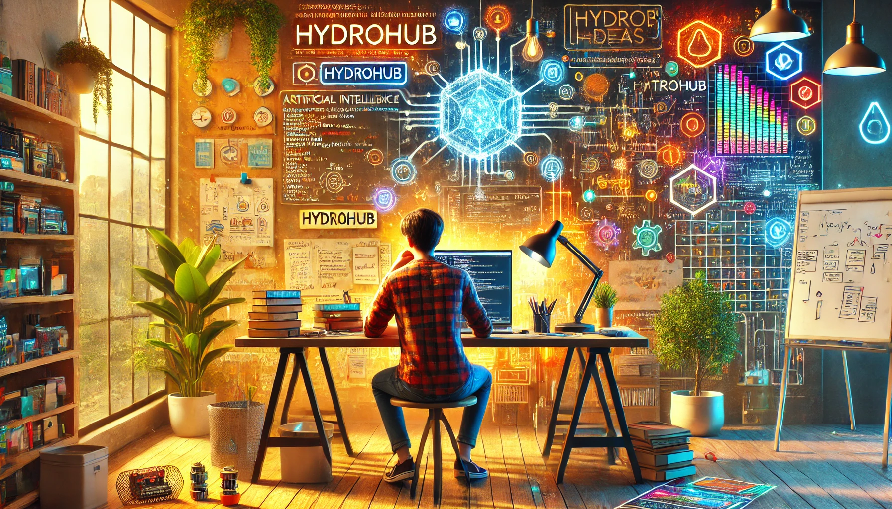

<h1 align="center">Hi 👋, I'm Revanth Chandika</h1>

  

  
  

---

## 🧠 About Me

I’m an **AI & Machine Learning student** passionate about **building intelligent systems that solve real problems** — not just academic demos.

My interests sit at the intersection of:
- **Machine Learning & Research**
- **Startup-ready product development**
- **AI for social & environmental impact**

I enjoy taking ideas from **problem → model → system → deployment**.

---

## 🚀 Current Focus

- 🤖 ML-powered **chatbots** (education, government schemes, awareness)
- 👁️ **Computer Vision** for smart infrastructure & energy efficiency
- 📊 Data-driven decision systems
- 🌐 End-to-end **AI product development**
- 🔬 Exploring research-oriented ML workflows

---

## 🛠️ Tech Stack

### 👨‍💻 Languages

---

### 🧠 AI / ML Frameworks & Libraries

---

### 🌐 Backend & Deployment

---

### 🗄️ Databases & Tools

---

## 📌 Projects

🔹 **Scheme Assist**  
AI chatbot that simplifies access to government schemes using NLP.

🔹 **HydroHub**  
Water-awareness platform with chatbot support and database-driven guidance.

🔹 **Student Guidance Chatbot**  
AI assistant for school students (Class 1–10) using text + visual explanations.

🔹 **Smart Energy Management System**  
Computer vision-based lighting system that reduces power consumption using occupancy detection.

---

## 🔬 Research & Problem Solving

- Image-based **entity extraction** with F1-score evaluation  
- ML model training, validation, and error debugging  
- Focus on **scalability, accuracy, and real-world constraints**

---

## 🎯 Goals

- 📈 Become deeply skilled in **applied machine learning**
- 🚀 Build **startup-grade AI products**
- 🧪 Explore ML research & system optimization
- 🌍 Create technology that delivers **real social impact**

---

## 🤝 Let’s Connect
- 💼 LinkedIn: https://www.linkedin.com/in/chandika-purna-revanth-199017262/
- 💻 GitHub: [github.com/Revanth1310](https://github.com/Revanth1310)
- 🤝 Open to collaborations, hackathons & research discussions

---

  <b>“Build systems. Solve problems. Create impact.”</b>

